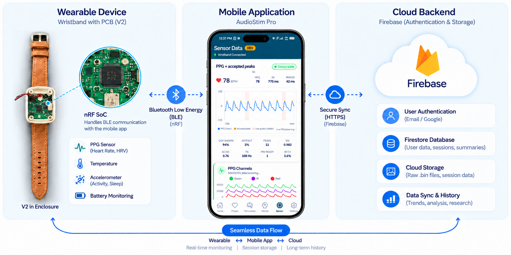
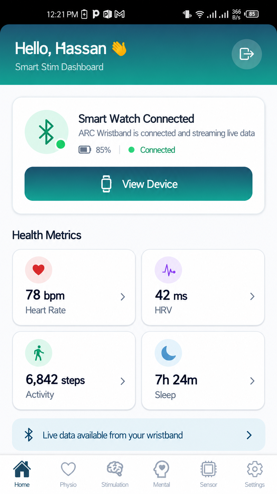
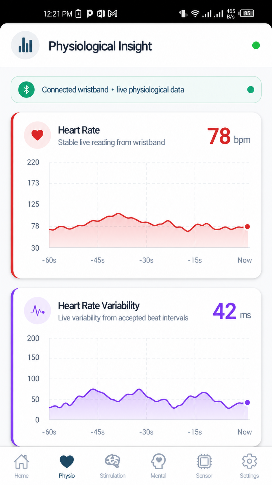
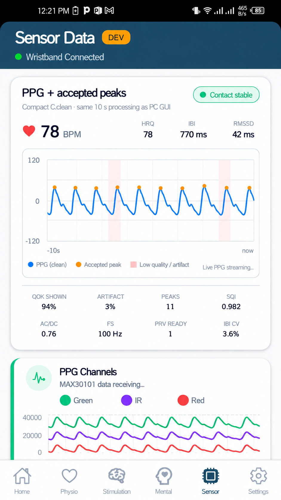

# AudioStim Pro — Smart Wristband Mobile Application

AudioStim Pro is the complete mobile application project for the Smart Stim / MH4384 wristband system. It connects to the wearable over Bluetooth Low Energy (BLE), displays live physiological and sensor data, synchronizes processed Algorithm V0 results, supports raw NAND-memory synchronization to `.bin`, integrates Firebase authentication and cloud services, and provides both normal-user and researcher/developer workflows.

This repository contains the complete **application-side project**. The wristband firmware is maintained separately so the mobile application and firmware can evolve and be versioned independently.

---

## 1. Project Overview

The app currently supports:

- Firebase email/password authentication
- Forgot-password email reset
- Google Sign-In
- BLE wristband connection
- Earbud connection support
- Live physiological data
- Algorithm V0 processed results
- Developer-mode raw sensor views
- Processed memory synchronization
- Raw NAND memory synchronization
- Resume support for interrupted raw sync
- Local `.bin` file generation
- Share / export of `.bin`
- Firebase Firestore synchronization
- Firebase-hosted web dashboard integration
- EAS cloud APK builds
- Sleep-duration presentation based on stored Algorithm V0 minute results
- App branding with the AudioStim brain-wave icon
- Main, Physio, Stimulation, Mental, Settings, and Developer/Sensor workflows
- Daily / weekly / monthly history architecture direction using real synchronized data
- Separation between user-facing physiological views and researcher/developer raw sensor views

---

## 2. System Overview

The Smart Wristband contains an nRF-based BLE SoC on the PCB. Sensor and processed data are transferred from the wearable to the AudioStim Pro mobile application over BLE. The application presents live and historical data and connects to Firebase services for authentication, structured application data, and planned raw-data cloud storage.



### Current Application Views

#### Main Dashboard

<p align="center">
  
</p>

#### Physiological Insight

<p align="center">
  
</p>

#### Sensor / Developer Mode

<p align="center">
  
</p>

---

## 3. Main Technology Stack

- React Native
- Expo SDK 54
- React 19
- React Native 0.81
- TypeScript
- React Navigation
- `react-native-ble-plx`
- Firebase Authentication
- Cloud Firestore
- Firebase Hosting
- Google Sign-In
- EAS Build

Important project versions are defined in `package.json`.

---

## 4. Project Structure

```text
AudioStimApp/
├── assets/
│   ├── adaptive-icon.png
│   ├── audiostim-brain-logo.png
│   ├── favicon.png
│   ├── icon.png
│   └── splash-icon.png
├── images/
│   ├── dev_mode.png
│   ├── flow.png
│   ├── main.png
│   └── physio.png
├── src/
│   ├── auth/
│   │   ├── AuthContext.tsx
│   │   └── googleAuth.ts
│   ├── components/
│   ├── firebase/
│   ├── functionality/
│   ├── hooks/
│   ├── native/
│   ├── navigation/
│   ├── pipeline/
│   ├── screens/
│   │   ├── auth/
│   │   ├── main/
│   │   ├── onboarding/
│   │   └── questionnaires/
│   ├── styles/
│   └── types/
├── App.tsx
├── app.json
├── eas.json
├── firebase.json
├── firestore.rules
├── google-services.json
├── index.ts
├── package.json
├── package-lock.json
├── tsconfig.json
└── README.md
```

---

## 5. Authentication

The app currently supports:

### Email and Password

Users can sign in with Firebase email/password authentication.

### Forgot Password

The login page uses Firebase password-reset email flow.

### Google Sign-In

Google Sign-In is integrated through:

```text
@react-native-google-signin/google-signin
```

Android package:

```text
com.abrehman.smartstimapp
```

The Firebase Android app and Google OAuth configuration must remain aligned with the EAS signing certificate.

---

## 6. Login UI and Branding

The current login page uses:

```text
src/screens/auth/LoginScreen.tsx
```

Current branding assets:

```text
assets/audiostim-brain-logo.png
assets/icon.png
assets/adaptive-icon.png
assets/splash-icon.png
assets/favicon.png
```

The login page keeps the existing blue AudioStim background and uses the brain-wave neurostimulation logo.

The page includes:

- Email field
- Password field
- Password visibility toggle
- Forgot password
- Get Started
- Sign In
- Continue with Google
- Sign Up
- Terms & Conditions
- Language selector

---

## 7. Main Navigation

Main bottom-tab navigation:

```text
src/navigation/MainTabsNavigator.tsx
```

Current primary tabs:

```text
Home
Physio
Stimulation
Mental
Settings
```

When Developer Mode is enabled:

```text
Sensor
```

is also shown.

The Sensor tab is intentionally treated as a detailed research/developer view.

---

## 8. Home Screen

Main file:

```text
src/screens/main/HomeScreen.tsx
```

The Home screen contains:

- User greeting
- Wristband connection status
- Earbud connection status
- Scan & Connect
- Recording state
- Health metric summary cards
- Live Heart Rate
- HRV
- Activity
- Sleep

The old `Recent Sessions` block has been removed from Home.

Historical trends should be presented through a proper dedicated daily / weekly / monthly history experience instead of a simple recent-session list.

---

## 9. Physio Screen

Main file:

```text
src/screens/main/PhysiologicalInsightScreen.tsx
```

The Physio section is designed for user-facing physiological information rather than raw engineering signals.

Current main content:

- Heart Rate
- HRV
- Activity Insight
- Skin Temperature
- Sleep

### Heart Rate

Displayed without extra `(Live)` text.

UI display range:

```text
30–220 bpm
```

### Skin Temperature

Temperature is available in both Physio and Sensor views.

UI display range:

```text
33–44 °C
```

### Activity

Physio shows interpreted activity information.

Detailed accelerometer and gyroscope signals belong in the Sensor / Developer view.

---

## 10. Sleep

Algorithm V0 already provides sleep information in its processed 60-second output.

Each processed minute contains:

```text
SLEEP=SLEEP
```

or:

```text
SLEEP=WAKE
```

and also includes sleep confidence.

The app does **not** create a new sleep algorithm.

Instead, the Physio screen uses the existing stored Algorithm V0 minute summaries to calculate the latest detected sleep duration.

Example:

```text
402 SLEEP minute records
= 402 minutes
= 6Hr 42min
```

The app displays the result in:

```text
xHr xxmin
```

format.

Current Algorithm V0 does **not** classify:

```text
REM
Light
Deep
```

Therefore the detailed sleep-stage visualization is kept as:

```text
Coming Soon
```

These stages must not be fabricated until the algorithm provides real stage classification.

---

## 11. Sensor / Developer View

Main file:

```text
src/screens/main/SensorTabScreen.tsx
```

The Sensor page is intended for detailed engineering/research inspection.

Depending on Developer Mode configuration, it can show:

- PPG Green
- PPG IR
- PPG Red
- Clean PPG waveform
- Accepted PPG peaks
- Accelerometer X/Y/Z
- Gyroscope X/Y/Z
- EDA
- Skin Temperature
- Quality / artifact-related information

The PPG + accepted-peaks visualization belongs in Sensor rather than Physio.

---

## 12. BLE

BLE functionality is located mainly under:

```text
src/functionality/
```

The app uses:

```text
react-native-ble-plx
```

BLE is responsible for:

- Wristband scanning
- Connection
- Disconnection
- Live sensor data
- Processed Algorithm V0 data
- Processed memory sync
- Raw NAND memory sync
- Resume support

The current validated firmware / Algorithm V0 behavior should not be changed from the app side when making UI-only changes.

---

## 13. Recording Sessions

A recording session is different from wristband memory.

There are three separate timelines in the system:

1. App recording session
2. Processed Algorithm V0 60-second history
3. Raw high-rate NAND sensor data

These should not be treated as the same dataset.

---

## 14. Wristband Memory

Memory controls are available from Settings.

The current workflow includes:

### Processed Memory

- Sync Memory
- Sync New Data
- View synchronized 1-minute Algorithm V0 results

### Raw Sensor Memory

- Sync Raw Data
- Resume interrupted raw sync
- Save `.bin`
- Share `.bin`

The raw data file is a NAND snapshot and may include data from multiple periods, not only the current app recording session.

---

## 15. Raw `.bin` Data

Raw `.bin` files can contain:

- PPG
- IMU
- EDA
- Temperature
- Algorithm V0 processed records
- Events
- Timestamps

The existing app keeps:

```text
Share / Save BIN
```

for research and external analysis.

Planned / recommended user experience:

```text
Wristband
→ BLE raw sync
→ local .bin
→ decode in app
→ display graphs/tables
→ optional cloud backup
→ optional export/share
```

For normal users, the technical `.bin` workflow should remain mostly hidden.

Researchers should still be able to export the original file.

---

## 16. Raw Data Size

Based on real captured data, current raw recording is approximately:

```text
~10 MiB/hour
~240–250 MB/day
```

for near-continuous worn operation.

For planning:

```text
100 users × 1 year
≈ 9–10 TB raw storage
```

Actual usage may be lower because raw sensor storage is wear-gated.

---

## 17. Cloud Architecture

Current Firebase project:

```text
audiostimulator-mhtech
```

Current cloud usage includes:

### Firebase Authentication

Used for:

- Email/password login
- Google Sign-In
- User identity

### Cloud Firestore

Used for lightweight structured data such as:

- User data
- Sessions
- Processed Algorithm V0 minute summaries
- App synchronization metadata

### Firebase Hosting

Used for the web dashboard.

### Cloud Storage

Raw `.bin` cloud backup is intended to use Firebase Cloud Storage.

Cloud Storage requires the project to use the Firebase Blaze billing plan.

Recommended architecture:

```text
Processed data
→ Firestore

Raw .bin data
→ Firebase Cloud Storage

Raw file metadata/reference
→ Firestore
```

Large binary files should not be stored directly in Firestore.

---

## 18. Recommended Cloud Path

Recommended raw-file structure:

```text
raw-data/<uid>/<device-id>/<file-name>.bin
```

Recommended metadata collection:

```text
users/{uid}/rawFiles/{fileId}
```

Possible metadata fields:

```text
fileName
fileSizeBytes
storagePath
deviceId
uploadedAt
cloudStatus
startTime
endTime
recordCount
firmwareVersion
```

Authenticated user-specific Storage rules should be used.

---

## 19. History View

The app should provide a proper historical-data experience.

The desired product direction is:

```text
Daily
Weekly
Monthly
```

history views.

The former history screens were mainly useful for demonstrating the intended experience.

The current goal is to implement the history using actual synchronized / cloud-backed data.

Normal users should not need to manually understand:

```text
NAND
.bin
raw pages
processed pages
```

The app should present a simple history interface while the technical storage architecture remains underneath.

---

## 20. Firebase Configuration

Important files:

```text
google-services.json
firebase.json
firestore.rules
src/firebase/firebaseConfig.ts
```

Do not publish secret credentials in source code.

Firebase web/API configuration values used by client SDKs are normally part of the app configuration, but privileged server credentials must never be committed.

---

## 21. Local Development Setup

Recommended environment:

- Git
- Node.js
- npm
- Expo
- EAS CLI access

Clone the project:

```powershell
git clone --branch appsyncv2 --single-branch https://github.com/mmsmedtech/Audio_Stimulator_App_Android.git .
```

Install exactly from the committed lockfile:

```powershell
npm ci
```

Do not use:

```powershell
npm audit fix --force
```

on this project without reviewing dependency impact.

---

## 22. TypeScript Check

Before every build:

```powershell
npx tsc --noEmit
```

No output means the TypeScript check passed.

---

## 23. Expo

The project is currently based on Expo SDK 54.

Project dependency:

```text
expo ~54.0.37
```

Always install project dependencies first before checking the Expo version.

Then:

```powershell
npx expo --version
```

---

## 24. EAS

Existing EAS project:

```text
@decodethehassan/smart-stim-app
```

Existing EAS Project ID:

```text
80bfd76e-e290-4bec-97b8-ecb341e0f5b4
```

Verify account:

```powershell
npx eas-cli@latest whoami
```

Expected EAS account:

```text
decodethehassan
```

Verify project link:

```powershell
npx eas-cli@latest project:info
```

Expected project:

```text
@decodethehassan/smart-stim-app
```

---

## 25. Android APK Build

The `preview` profile in `eas.json` builds an APK.

Build command:

```powershell
npx eas-cli@latest build -p android --profile preview
```

Android Studio is not required for EAS cloud builds.

Keep the existing Android signing credentials / keystore.

Do not create a new EAS project or new signing identity unless intentionally migrating the application.

---

## 26. Android Configuration

Current Android application package:

```text
com.abrehman.smartstimapp
```

The app uses:

```text
google-services.json
```

for Firebase Android configuration.

Important Expo plugins include:

```text
react-native-ble-plx
expo-font
@react-native-google-signin/google-signin
```

---

## 27. App Icons

Current branding assets:

```text
assets/icon.png
assets/adaptive-icon.png
assets/splash-icon.png
assets/favicon.png
assets/audiostim-brain-logo.png
```

Usage:

```text
icon.png
→ main app icon

adaptive-icon.png
→ Android adaptive launcher icon

splash-icon.png
→ splash screen

favicon.png
→ web icon

audiostim-brain-logo.png
→ in-app login logo
```

---

## 28. Git Workflow

Current main working branch:

```text
appsyncv2
```

Check status:

```powershell
git status
```

Stage changes:

```powershell
git add .
```

Commit:

```powershell
git commit -m "describe changes"
```

Push:

```powershell
git push origin appsyncv2
```

Verify:

```powershell
git status
```

Expected clean result:

```text
nothing to commit, working tree clean
```

---

## 29. Important Development Rules

When modifying the app:

- Do not change validated Algorithm V0 logic for UI issues.
- Do not change sensor sample rates to solve UI/BLE problems.
- Do not auto-erase wristband NAND.
- Do not overwrite stored raw memory automatically.
- Keep raw export available for researchers.
- Keep normal-user workflows simple.
- Keep technical controls under Developer / Researcher modes when appropriate.
- Keep cloud and local storage as separate layers.
- Preserve offline/raw local capability even when cloud is unavailable.
- Run TypeScript checks before building.
- Avoid dependency upgrades unless required and tested.

---

## 30. Storage-Full Product Direction

Desired safe workflow:

```text
NAND approaches full
→ app warns user
→ raw data synchronized
→ local backup verified
→ cloud backup confirmed when enabled
→ user explicitly confirms erase
→ wristband NAND erased
```

Never automatically erase wristband memory.

---

## 31. Normal User vs Researcher Experience

### Normal User

The desired experience is:

```text
Connect wristband
→ see current data
→ see saved/history data
→ cloud-backed data available automatically
```

Normal users should not need to understand `.bin` files or memory-page formats.

### Researcher / Developer

Advanced users can access:

- Raw sensor graphs
- PPG channels
- IMU
- EDA
- Temperature
- Algorithm V0
- Events
- Raw timestamps
- Share/export `.bin`
- Manual synchronization
- Developer settings

---

## 32. Current Known Limitations / Future Work

Planned or incomplete items include:

- Full daily / weekly / monthly history implementation using real stored data
- In-app raw `.bin` decoding and visualization
- Firebase Storage raw `.bin` backup
- Cloud raw-file metadata and retry state
- Better raw-file indexing/downsampling for large files
- Detailed sleep-stage classification
- REM / Light / Deep sleep visualization
- Improved automatic history/cloud synchronization
- Background-transfer strategy for large raw files
- Additional BLE throughput optimization where needed

---

## 33. Build Checklist

Before generating a client APK:

```text
[ ] Correct branch: appsyncv2
[ ] npm ci completed
[ ] npx tsc --noEmit passes
[ ] Correct Firebase configuration present
[ ] Correct EAS account logged in
[ ] Existing EAS project confirmed
[ ] UI changes tested
[ ] BLE connection tested
[ ] Email/password login tested
[ ] Forgot-password flow tested
[ ] Google Sign-In tested
[ ] Processed memory sync tested
[ ] Raw sync tested
[ ] .bin Save/Share tested
[ ] Developer Sensor view tested
[ ] Physio view tested
[ ] App icon / splash branding checked
[ ] EAS preview APK built
```

---

## 34. Repository Scope

This repository is the **complete AudioStim Pro mobile application project**, including application source code, navigation, authentication, BLE integration, Firebase configuration, memory-sync workflows, UI assets, branding, and project documentation.

The wristband firmware is intentionally maintained in its own dedicated repository/project rather than embedded inside the mobile app repository.

That keeps:

- app source
- firmware source
- release history
- issues
- CI/build configuration

cleanly separated.

---


<p align="center">
  <strong>Developed for MHTechFusion</strong>
</p>
